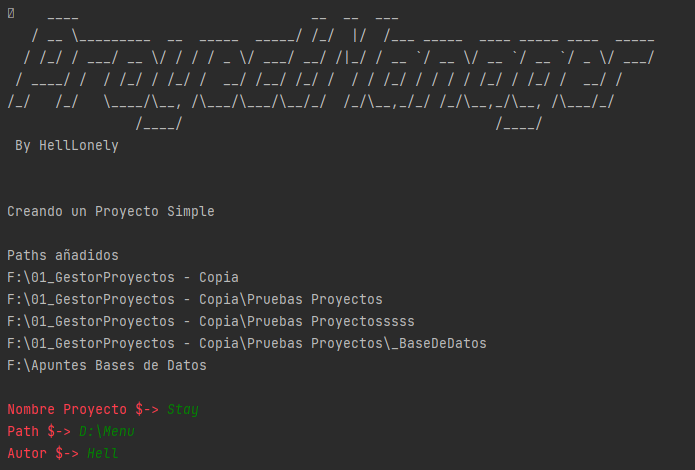
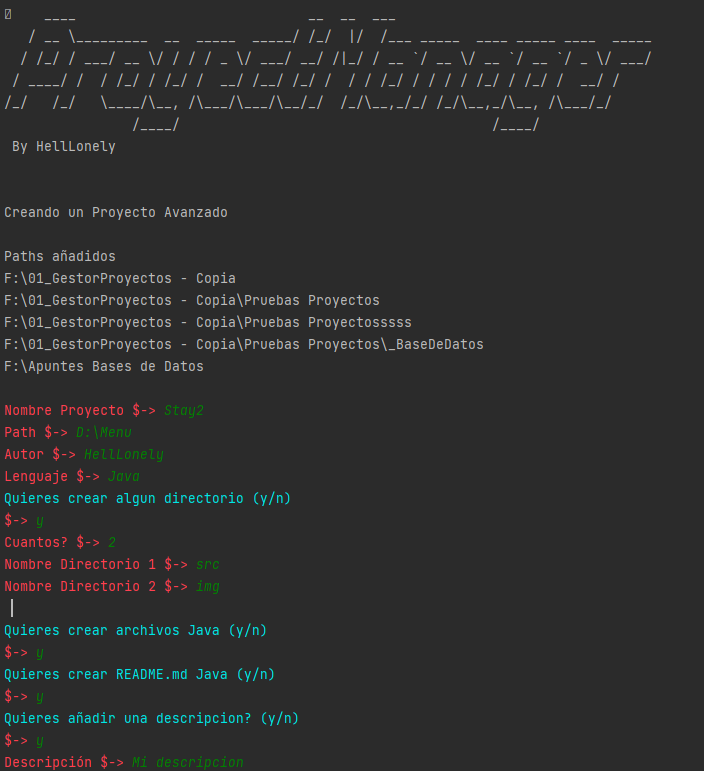

# Proyect Manager 📂

Script en python que funciona como un mini gestor de ficheros y proyectos.

## Utilidades 🔧

Por el momento soporta pocas funcionalidades y todas son algo básicas 😅. Pero por el momento tiene.

### ↓ Utilidades ↓

1. Crear proyectos básicos, los cuales consisten en crear un fichero con un archivo de configuración muy simple.

2. Crear un proyecto más complejo donde se ofrece la posibilidad de escoger lenguaje de programación, creación de ficheros interiores, insertar un README...

